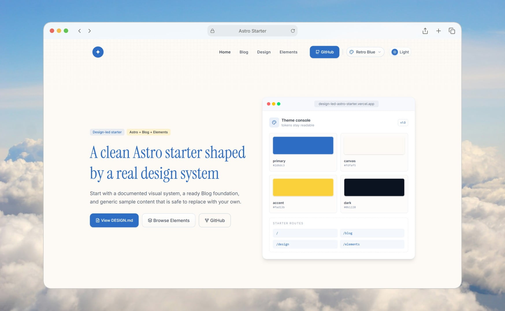

# Design-led Astro Starter

[English](README.md) · [通用演示站](https://ricoui-astro-starter.vercel.app/)

一个以设计为驱动的 Astro starter 模板，公开页面保持纯净：Home、Blog、DESIGN.md、Elements。

它适合想先拥有一套完整视觉风格，再快速构建自己项目的人。模板保留了 RicoUI 的编辑感标题字体、暗色模式、可复用 UI 组件、MDX Blog 内容系统，并加入了多主题色切换。



## 在线预览

英文版：[Live demo](https://ricoui-astro-starter.vercel.app/)
中文版地址：[Live demo zh](https://ricoui-astro-starter-zh.netlify.app/)


## 主题

模板内置 10 套可切换的主题配色。它们都覆盖同一套语义 token，因此切换主题只改变页面气质，所有组件依旧保持一致。默认主题为 Retro Blue，其余主题可在主题切换器中一键切换。

<table>
  <tr>
    <td width="50%" align="center"><br><sub><b>Retro Blue</b><br>温暖的编辑感蓝 + 金 · 默认</sub></td>
    <td width="50%" align="center"><br><sub><b>Minimal Mono</b><br>克制的黑白与暖灰</sub></td>
  </tr>
  <tr>
    <td width="50%" align="center"><br><sub><b>Forest Green</b><br>沉静的植物系绿</sub></td>
    <td width="50%" align="center"><br><sub><b>Vellum Ink</b><br>温暖羊皮纸 + 墨色</sub></td>
  </tr>
  <tr>
    <td width="50%" align="center"><br><sub><b>Creator Yellow</b><br>明亮的创作者经济黄</sub></td>
    <td width="50%" align="center"><br><sub><b>Precision Orange</b><br>技术中性 + 橙色信号</sub></td>
  </tr>
  <tr>
    <td width="50%" align="center"><br><sub><b>Comic Pulp</b><br>柔和的漫画感</sub></td>
    <td width="50%" align="center"><br><sub><b>Midnight Pastel</b><br>暗色工作台 + 柔和粉彩</sub></td>
  </tr>
  <tr>
    <td width="50%" align="center"><br><sub><b>Sky Blue</b><br>淡蓝白产品色</sub></td>
    <td width="50%" align="center"><br><sub><b>Signal Red</b><br>务实的企业红强调</sub></td>
  </tr>
</table>

在 `src/config/themes.js` 中设置 `defaultThemeId` 选择默认主题，或在生产站关闭主题切换器。

## 技术栈

- Astro 7 与 TypeScript
- Tailwind CSS v4 与 `@tailwindcss/vite`
- Astro Content Layer、MDX、RSS、sitemap
- Sharp 本地图像处理

## 快速开始

```bash
pnpm install
pnpm dev
```

本地开发地址为 `http://localhost:5200`。

## 优先修改的位置

仓库中的默认值均为通用示例；创建自己的站点时，请从下列位置开始替换。

| 位置 | 用途 |
| --- | --- |
| `src/config/site.js` | 标题、规范 URL、SEO 信息和源码链接 |
| `src/config/themes.js` | 默认主题、主题包与语义 token |
| `src/styles/global.css`、`src/styles/themes.css` | 字体、基础样式与主题变量 |
| `src/content/post/` | 示例 MDX 文章与 frontmatter |
| `docs/DESIGN.md` | 给设计者、开发者和 AI 编码工具共用的视觉规范 |
| `src/pages/index.astro` | 首页区块和示例文案 |

如果生产站只需要固定主题，在 `src/config/themes.js` 选定 `defaultThemeId` 后，将 `showThemeSwitcher` 和 `persistUserSelection` 都设为 `false`。

## 路由

| 路由 | 用途 |
| --- | --- |
| `/` | 通用模板概览 |
| `/blog` | MDX 示例文章列表 |
| `/blog/[slug]` | 文章详情 |
| `/design` | 浏览器中的设计规范 |
| `/elements` | 组件和 token 参考页 |
| `/rss.xml` | RSS 订阅源 |

## 项目结构

```text
docs/                 设计系统文档
public/assets/        可替换的通用图片
src/components/       可复用区块、卡片、UI 与 widgets
src/config/           站点与主题配置
src/content/post/     MDX 文章
src/layouts/          布局与元数据
src/pages/            Astro 路由
src/styles/           全局、主题和文章样式
```

## 构建与部署

```bash
pnpm build
pnpm preview
```

构建前设置 `PUBLIC_SITE_URL` 为最终部署地址；它会用于 canonical URL、sitemap、RSS 和 Open Graph 元数据。审核演示站固定为 `https://ricoui-astro-starter.vercel.app/`，应部署这个仓库的原样构建。后续为自己的站点定制时，请使用独立部署地址。

## 许可证

[MIT](LICENSE)
